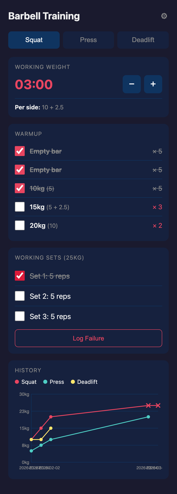
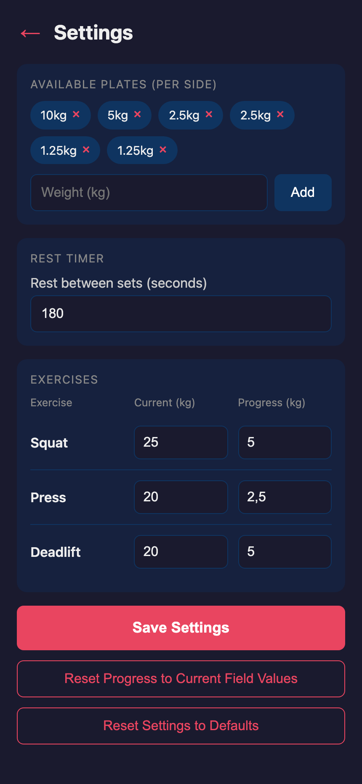

# Barbell Training
Simple app to aid with barbell training. Shows warmup sets with plate breakdowns and tracks progression.
Data is stored in json files.

Supported Exercises:
* Squat
* Overhead Press
* Deadlift

Features:
* Warmup calculator (empty bar, 40%, 60%, 80%)
* Shows which plates to load per side
* Auto progression after completing working sets
* History Graph
  
Settings:
* Specify plates you own
* Starting weights per exercise
* Progression weight to add each time after a completed workout
